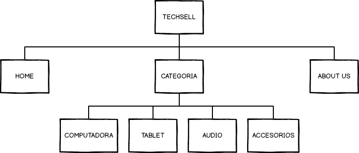
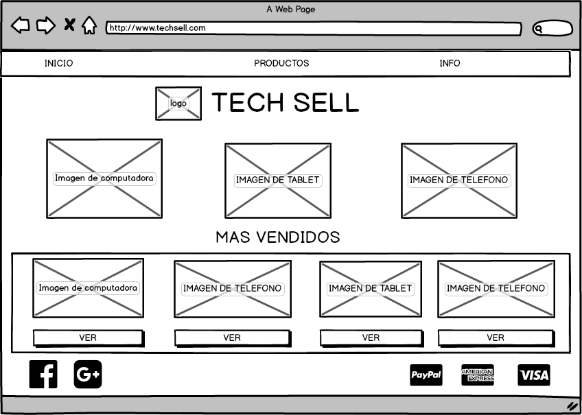
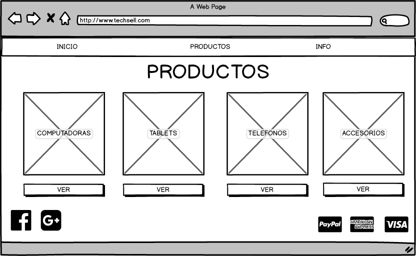
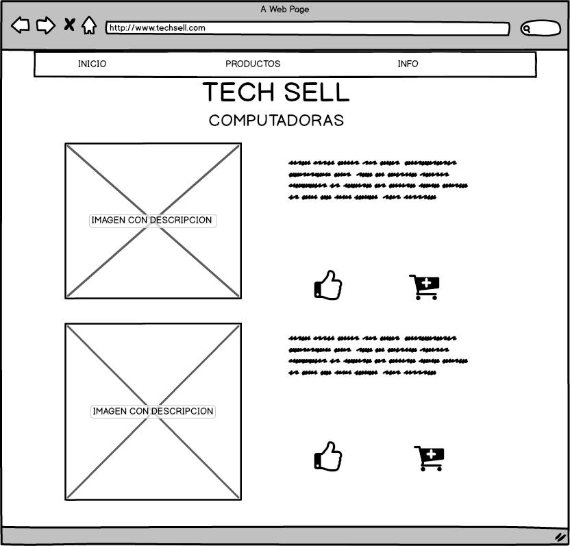
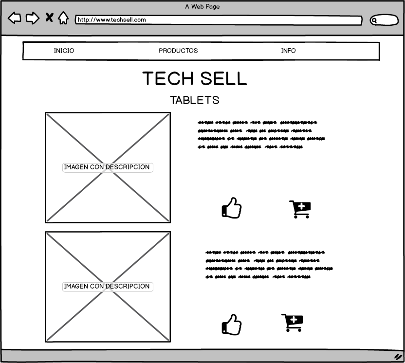
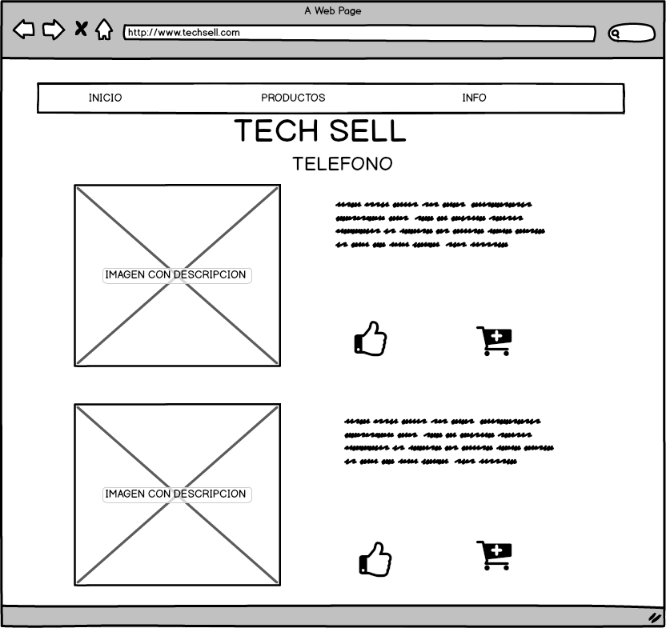
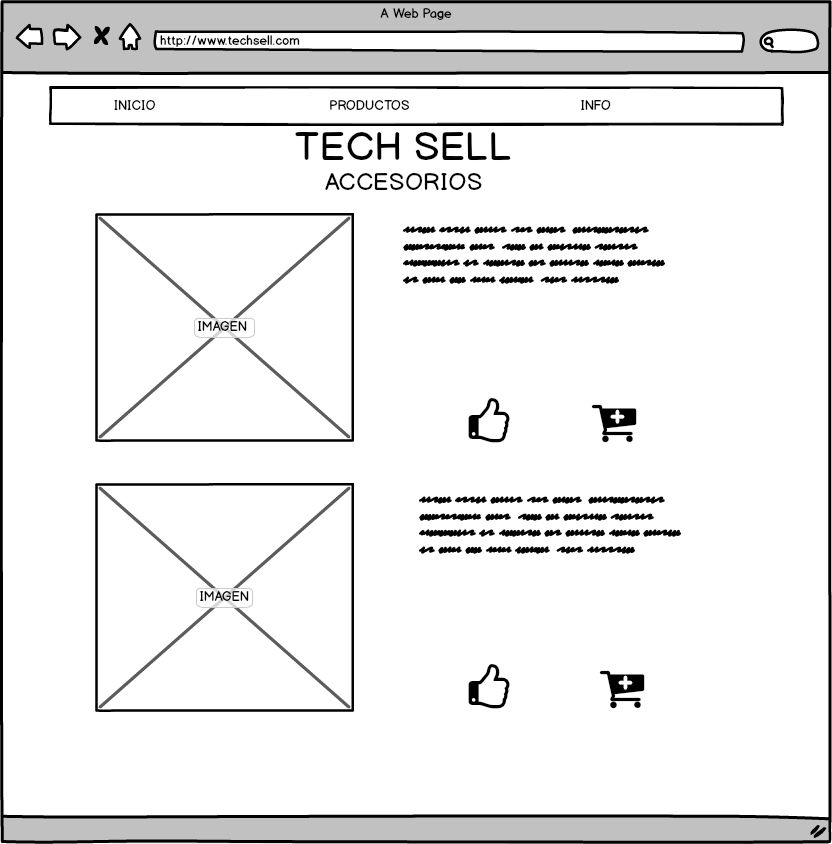

# WEB

Pagina web de productos tecnologicos

## MAPA DE SITIO

La pagina web consta de 3 secciones:
 1. Inicio: Esta seccion es la pagina de bienvenida y muestra imagenes de los productos.
 2. productos: Cuenta con cuatro subsecciones que son computadoras, tablets, audio y accesorios.
 3. Info: En esta seccion se muestra un formulario para enviar comentarios al sitio.

## PAGINA PRINCIPAL

Esta es la primera pagina que el usuario ve cuando entra al sitio.
Muestra imagenes sobre los productos que se venden y en el pie de pagina
se señala los metodos de pago y las redes sociales.

## PAGINA PRODUCTOS

En esta seccion se muestra cuatro imagenes cada una te lleva a la categoria que le corresponde, las cuales son:
1. computadoras
2. tablets
3. Telefono
4. accesorios

## PAGINA COMPUTADORAS

En esta seccion se muestran los productos que se venden junto con su descripcion. En cada producto se muestra la opcion de agregar al carrito de compras y si a el usuario le gusta el producto puede hacer clic en el boton con el pulgar arriba.

## PAGINA TABLETS

En esta seccion se muestran los productos que se venden junto con su descripcion. En cada producto se muestra la opcion de agregar al carrito de compras y si a el usuario le gusta el producto puede hacer clic en el boton con el pulgar arriba.

## PAGINA TELEFONO

En esta seccion se muestran los productos que se venden junto con su descripcion. En cada producto se muestra la opcion de agregar al carrito de compras y si a el usuario le gusta el producto puede hacer clic en el boton con el pulgar arriba.

## PAGINA ACCESORIOS

En esta seccion se muestran los productos que se venden junto con su descripcion. En cada producto se muestra la opcion de agregar al carrito de compras y si a el usuario le gusta el producto puede hacer clic en el boton con el pulgar arriba.

## PAGINA INFO

En esta pagina se muestra un formulario para que el usuario envie comentarios al sitio y ademas cuenta con informacion para contactar por otros medios al sitio.
