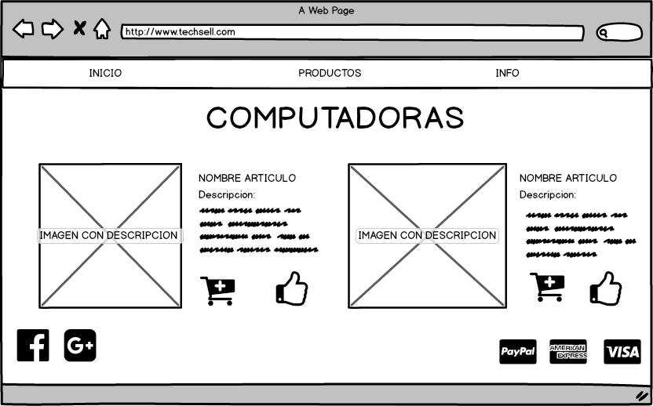
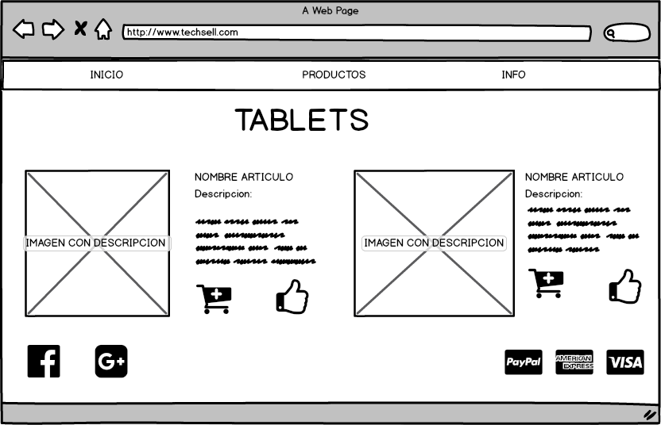
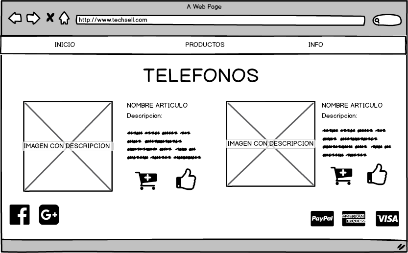
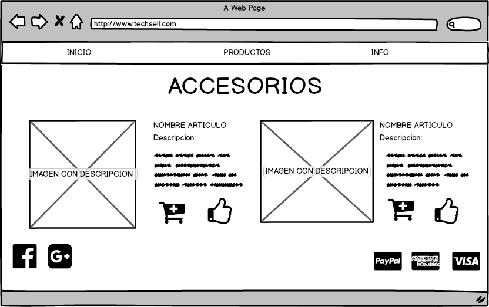

# WEB

Pagina web de productos tecnol�gicos

## MAPA DE SITIO

La pagina web consta de 3 secciones:

 1. Inicio: Esta secci�n es la pagina principal.
 2. Productos: Cuenta con cuatro secciones que son computadoras, tablets, telefono y accesorios.
 3. Info: En esta secci�n se muestra un formulario para enviar comentarios al sitio.

## PAGINA PRINCIPAL

Esta es la primera pagina que el usuario ve cuando entra al sitio.
Muestra im�genes sobre los productos que se venden y de los productos mas vendidos. En el pie de pagina
se señala los m�todos de pago y las redes sociales.

## PAGINA PRODUCTOS

En esta secci�n se muestra cuatro im�genes cada una te lleva a la categor�a que le corresponde, las cuales son:

1. Computadoras
2. Tablets
3. Tel�fono
4. Accesorios

## PAGINA COMPUTADORAS

En esta secci�n se muestran los productos que se venden junto con su descripci�n. En cada producto se muestra la opci�n de agregar al carrito de compras y si a el usuario le gusta el producto puede hacer clic en el bot�n con el pulgar arriba.

## PAGINA TABLETS

En esta secci�n se muestran las tablets que estan en venta junto con su descripci�n. En cada producto se muestra la opci�n de agregar al carrito de compras y si a el usuario le gusta el producto puede hacer clic en el bot�n con el pulgar arriba.

## PAGINA TELEFONO

En esta secci�n se muestran los telefonos que estan en venta junto con su descripci�n. En cada producto se muestra la opci�n de agregar al carrito de compras y si a el usuario le gusta el producto puede hacer clic en el bot�n con el pulgar arriba.

## PAGINA ACCESORIOS

En esta secci�n se muestran los accesorios que se venden junto con su descripci�n. En cada producto se muestra la opci�n de agregar al carrito de compras y si a el usuario le gusta el producto puede hacer clic en el bot�n con el pulgar arriba.

## PAGINA INFO

En esta pagina se muestra un formulario para que el usuario env�e comentarios al sitio, los datos que se solicitan en este formulario son: Nombre, telefono y correo. Ademas del comentario que desea enviar el usuario. 
